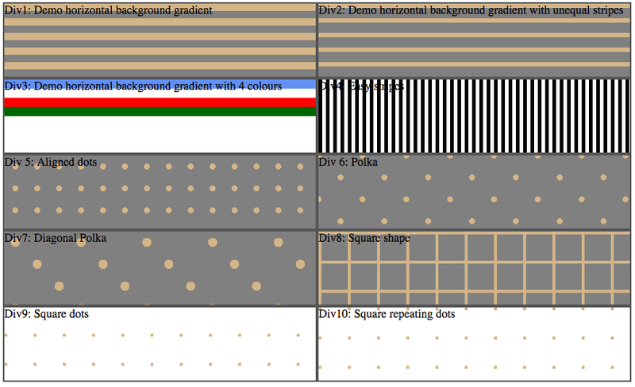

# Gradient

How to make gorgeus background without using images.
`radial-gradient` and `linear-gradient` to the rescue!


## div1: 2 horizontal stripes
To display a 2 color equal stripes background:
```css
div.horizontal-stripes {
  background: linear-gradient(#f06 50%, yellow 50%);
  background-size: 100% 20px;
}
```
Note:
* shorthand `background` for `background-image`
* default `background-repeat` repeat

## div3: 4 stripes of different colours
To display a 4 color equal stripes background:
```css
div.horizontal-stripes-four-colors {
  background: linear-gradient(blue 0, blue 25%, white 25%, white 50%, red 50%, red 75%, green 75%, green 100%);
  background-size: 100% 50px;
  background-repeat: no-repeat;
}
```
Note:
* shorthand `background` for `background-image`
* `linear-gradient(blue 0, blue 25%, white 25%, white 50%, red 50%, red 75%, green 75%, green 100%);` could be simplified to
`linear-gradient(blue 25%, white 25%, white 50%, red 50%, red 75%, green 0);`
* adding `background-repeat: no-repeat` to not repeat

## div4: Polka
```css
div.polka {
  background-color: grey;
  background-image: radial-gradient(circle, tan 10%, transparent 10%), radial-gradient(circle, tan 10%, transparent 10%);
  background-size: 60px 60px;
  background-position: 0 0, 30px 30px;
}
```

## div9,10: Square dots

```css
div.square-dots {
  background-image: linear-gradient(90deg, transparent 0%, transparent 10%, white 10%, white 100%),
  linear-gradient(0deg, tan 0%, tan 10%, white 10%, white 100%);
  background-size: 40px 40px;
}

div.square-repeating-dots {
   background-image: repeating-linear-gradient(90deg, transparent, transparent 4px, white 4px,white 40px), repeating-linear-gradient(tan, tan 4px, white 4px,white 40px);
}
```