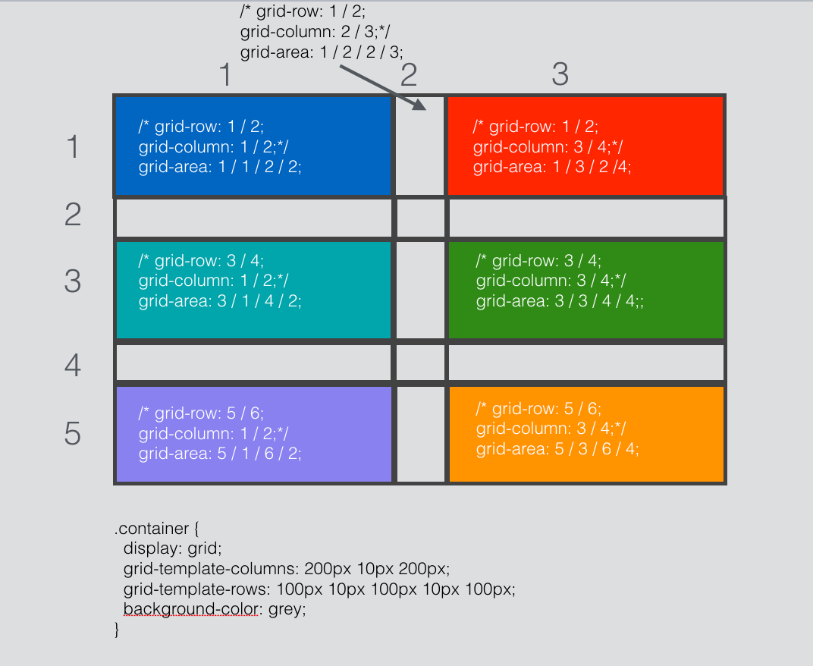

# Grid

This March 2017, with Chrome 57 release, the browser is now[supporting Grid CSS](https://developers.google.com/web/updates/2017/03/nic57). No need to enable experimental support, update to the latest and have fun.

## Define a grid

We define a 3 columns per 5 rows gris where the middle column (ie: 2) is used a glutter and ro2 2 & 5 are glutter too.

Use `grid-row` and `grid-column` to position your box or use short `grid-area` where:
```css
gris-area: grid-row-atart / grid-column-start / grid-row-end / grid-column-end
```

See diagram:

